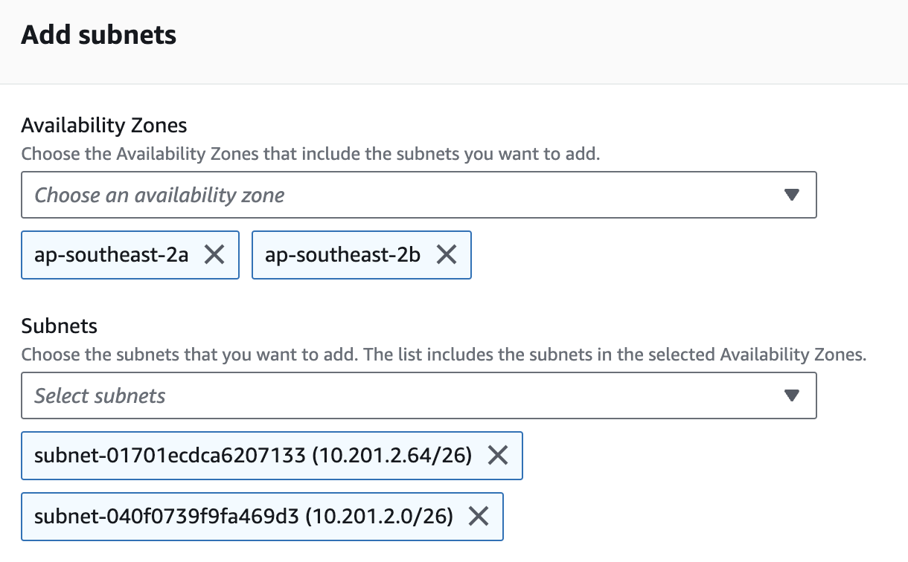

# Step-by-step Instruction To Set Up SSIS On RDS

### Create VPC and Subnets
1. In VPC service, create a VPC with “VPC and more” option.
1. Enter `ssis-demo` in Name tag auto-generation field.
1. Enter `10.201.0.0/22` in IPv4 CIDR block field. 
1. Keep all other settings as default and click on “Create VPC” button at the bottom.

### Create S3 Bucket

1. Create a bucket named `dewey-ssis-demo`.
2. In IAM service, create a policy named `ssis-demo-s3-access-policy` with the following permission that allows access to the bucket.
```
{
    "Version": "2012-10-17",
    "Statement": [
        {
            "Effect": "Allow",
            "Action": "s3:ListAllMyBuckets",
            "Resource": "*"
        },
        {
            "Effect": "Allow",
            "Action": [
                "s3:ListBucket",
                "s3:GetBucketACL",
                "s3:GetBucketLocation"
            ],
            "Resource": "arn:aws:s3:::dewey-ssis-demo"
        },
        {
            "Effect": "Allow",
            "Action": [
                "s3:GetObject",
                "s3:PutObject",
                "s3:ListMultipartUploadParts",
                "s3:AbortMultipartUpload"
            ],
            "Resource": "arn:aws:s3:::dewey-ssis-demo/*"
        }
    ]
}
```
3. Navigate to IAM -> Roles and click "Create role".
4. Keep "AWS service" as Trusted entity type.
5. Select `RDS` from the Service or use case dropdown.
6. Select `RDS - Add Role to Database` and click "Next".
7. In the Add permissions page, search and select `ssis-demo-s3-access-policy` and click "Next".
8. Enter `ssis-demo-s3-access-role` in Role name field and click "Create role".

### Create Active Directory
1. Navigate to Directory Service -> Active Directory -> Directories and click "Set up directory".
2. Keep Directory types as `AWS Managed Microsoft AD` and click "Next".
3. Select `Standard Edition`.
4. Enter `ssisdemo.com` in Directory DNS name field.
5. Leave Directory NetBIOS name blank.
6. Enter `<AD admin password>` in Admin password and Confirm password field and click "Next".
7. In VPC and subnets page, select the VPC created in previous step.
8. Choose the two private subnets in the selected VPC in Subnets field and click "Next".
9. Confirm all the details in the next page and click "Create directory".
10. Wait for 45 minutes.

### Create EC2 Instance with Visual Studio SSIS extension, SSMS and AD tools
1. Navigate to EC2 -> Instances and click "Launch instance".
2. Enter `ssis-demo-visual-studio` in Name field.
3. Select `Microsoft Windows Server 2019` Base as AMI.
4. Select appropriate instance size. Minimum `t3.large` recommended.
5. Create a new key pair named `ssis-demo-key-pair` and save the downloaded key.
6. Edit Network settings and choose `ssis-demo-vpc` in the VPC dropdown.
7. In the subnet dropdown, select one of the public subnets.
8. Set Auto-assign public IP to `Enable`.
9. Enter `ssis-demo-ec2-sg` in Security group name field.
10. Expand Advanced details section.
11. Select `ssisdemo.com` in Domain join directory field.
12. Click `Create new IAM profile` link to create a IAM role to allow the EC2 to join the domain.
13. Click `Create role` in the Roles page.
14. Select `EC2` as use case and click "Next".
15. Select both permission `AmazonSSMManagedInstanceCore` and `AmazonSSMDirectoryServiceAccess` and click "Next".
16. Enter `ssis-demo-ec2-instance-profile` in Role name field.
17. Click "Create role" and return to EC2 Launch Instance page.
18. Refresh IAM instance profile options and select the created role.
19. Click "Launch instance" and wait for 10 minutes.
20. RDP into the instance using username `ssisdemo.com\Admin` and `<AD admin password>`.
21. Install Active Directory administration tools using the following PowerShell command.
```
Install-WindowsFeature RSAT-ADDS
```
21. Once the installation finishes, launch "Active Directory Users and Computers" from Windows Start menu.
22. `placeholder: add service account for SSIS`
23. Install SQL Server Management Studio.
24. Install Visual Studio 2022 with SQL Server Data Tool and SSIS extension.

### Create RDS Instance

#### Create Subnet Group
1. Navigate to RDS -> Subnet groups page and click on "Create DB subnet".
2. Enter `ssis-demo-subnet-group` in the Name field.
3. Enter a description for the subnet group.
4. Choose `ssis-demo-vpc` in the VPC dropdown.
5. Select two availability zones that match the created subnets in previous step.
6. Select the two private subnets created before (refer to the subnet page in VPC service to get subnet IDs).
   
7. Click on "Create".

#### Create RDS Instance
1. Navigate to RDS -> Databases and click on "Create database".
2. Keep creation method as "Standard create".
3. Select `Microsoft SQL Server` in Engine options.
4. Change Edition to `SQL Server Standard Edition`.
5. Keep "SQL Server 2019 15.00.4345.5.v1" as Engine Version.
6. Choose `Dev/Test` in Templates (use "Production" if it's for production environment).
7. Enter `ssis-demo-database` in DB instance identifier field.
8. Enter `<password>` in Master password and Confirm master password fields.
9. Choose appropriate DB instance class for the designated workload.
10. Enter `appropriate size` in the Allocated storage field.
11. Choose the VPC created in previous step in the VPC dropdown.
12. In DB subnet group, select `Choose existing` and select the subnet group created in previouse step.
13. In VPC security group (firewall), select `Create new`.
14. Enter `ssis-demo-vpc-rds-sg` in New VPC security group name field.
15. Tick the checkbox "Enable Microsoft SQL Server Windows authentication".
16. Leave Windows authentication type as "AWS Managed Microsoft Active Directory".
17. Click "Browse Directory" and choose the domain created in previous step.
18. Click "Create database" and wait for 15 minutes.
