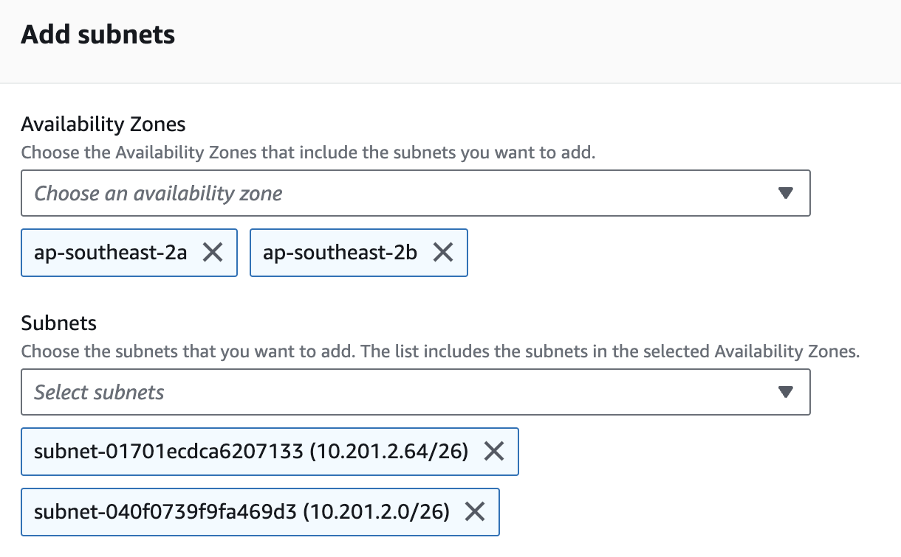
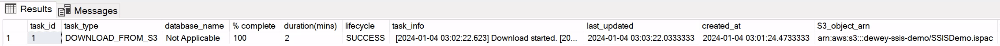
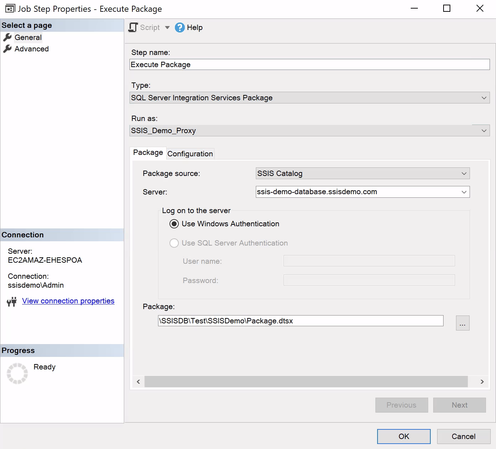

# Step-by-step Instruction To Set Up SSIS On RDS

#### Note
It's good practice to add tags to all AWS resources being created so that the cost of the solution can be tracked.

### Create VPC and Subnets
1. In VPC service, create a VPC with “VPC and more” option.
1. Enter `ssis-demo` in Name tag auto-generation field.
1. Enter `10.201.0.0/22` in IPv4 CIDR block field. 
1. Keep all other settings as default and click on “Create VPC” button at the bottom.

### Create S3 Bucket

1. Create a bucket named `dewey-ssis-demo`.
2. In IAM service, create a policy named `ssis-demo-s3-access-policy` with the following permission that allows access to the bucket.
```
{
    "Version": "2012-10-17",
    "Statement": [
        {
            "Effect": "Allow",
            "Action": "s3:ListAllMyBuckets",
            "Resource": "*"
        },
        {
            "Effect": "Allow",
            "Action": [
                "s3:ListBucket",
                "s3:GetBucketACL",
                "s3:GetBucketLocation"
            ],
            "Resource": "arn:aws:s3:::dewey-ssis-demo"
        },
        {
            "Effect": "Allow",
            "Action": [
                "s3:GetObject",
                "s3:PutObject",
                "s3:ListMultipartUploadParts",
                "s3:AbortMultipartUpload"
            ],
            "Resource": "arn:aws:s3:::dewey-ssis-demo/*"
        }
    ]
}
```
3. Navigate to IAM -> Roles and click "Create role".
4. Keep "AWS service" as Trusted entity type.
5. Select `RDS` from the Service or use case dropdown.
6. Select `RDS - Add Role to Database` and click "Next".
7. In the Add permissions page, search and select `ssis-demo-s3-access-policy` and click "Next".
8. Enter `ssis-demo-s3-access-role` in Role name field and click "Create role".

### Create Active Directory
1. Navigate to Directory Service -> Active Directory -> Directories and click "Set up directory".
2. Keep Directory types as `AWS Managed Microsoft AD` and click "Next".
3. Select `Standard Edition`.
4. Enter `ssisdemo.com` in Directory DNS name field.
5. Leave Directory NetBIOS name blank.
6. Enter `<AD admin password>` in Admin password and Confirm password field and click "Next".
7. In VPC and subnets page, select the VPC created in previous step.
8. Choose the two private subnets in the selected VPC in Subnets field and click "Next".
9. Confirm all the details in the next page and click "Create directory".
10. Wait for 45 minutes.

### Create EC2 Instance with Visual Studio SSIS extension, SSMS and AD tools
1. Navigate to EC2 -> Instances and click "Launch instance".
2. Enter `ssis-demo-visual-studio` in Name field.
3. Select `Microsoft Windows Server 2019` Base as AMI.
4. Select appropriate instance size. Minimum `t3.large` recommended.
5. Create a new key pair named `ssis-demo-key-pair` and save the downloaded key.
6. Edit Network settings and choose `ssis-demo-vpc` in the VPC dropdown.
7. In the subnet dropdown, select one of the public subnets.
8. Set Auto-assign public IP to `Enable`.
9. Enter `ssis-demo-ec2-sg` in Security group name field.
10. Expand Advanced details section.
11. Select `ssisdemo.com` in Domain join directory field.
12. Click `Create new IAM profile` link to create a IAM role to allow the EC2 to join the domain.
13. Click `Create role` in the Roles page.
14. Select `EC2` as use case and click "Next".
15. Select both permission `AmazonSSMManagedInstanceCore` and `AmazonSSMDirectoryServiceAccess` and click "Next".
16. Enter `ssis-demo-ec2-instance-profile` in Role name field.
17. Click "Create role" and return to EC2 Launch Instance page.
18. Refresh IAM instance profile options and select the created role.
19. Click "Launch instance" and wait for 10 minutes.
20. RDP into the instance using username `ssisdemo.com\Admin` and `<AD admin password>`.
21. Install Active Directory administration tools using the following PowerShell command.
```
Install-WindowsFeature RSAT-ADDS
```
21. Once the installation finishes, launch "Active Directory Users and Computers" from Windows Start menu.
22. Navigate to the Users page under the created domain.
23. Install [SQL Server Management Studio 19.2](https://aka.ms/ssmsfullsetup).
24. Install [Visual Studio Community 2022](https://visualstudio.microsoft.com/vs/community/) with SQL Server Data Tool and [SSIS extension](https://marketplace.visualstudio.com/items?itemName=SSIS.MicrosoftDataToolsIntegrationServices).

### Create RDS Instance

#### Create Subnet Group
1. Navigate to RDS -> Subnet groups page and click on "Create DB subnet".
2. Enter `ssis-demo-subnet-group` in the Name field.
3. Enter a description for the subnet group.
4. Choose `ssis-demo-vpc` in the VPC dropdown.
5. Select two availability zones that match the created subnets in previous step.
6. Select the two private subnets created before (refer to the subnet page in VPC service to get subnet IDs).
   
7. Click on "Create".

#### Create Parameter Group
1. Navigate to RDS -> Parameter groups and click "Create parameter group".
2. Select `sqlserver-se-15.0` from Parameter group family dropdown.
3. Enter `ssis-demo-sql-param-group` in the Group Name field.
4. Enter any description in the Description field and click "Create".
5. Click on the parameter group just created and click "Edit".
6. Search for `clr` in the search box.
7. Change the value for "clr enabled" to `1` and save changes.

#### Create Option Group
1. Navigate to RDS -> Option groups and click "Create group". 
2. Enter `ssis-demo-sql-option-group` in the Name field.
3. Enter any description in the Description field.
4. Choose `sqlserver-se` from the Engine dropdown.
5. Choose `15.00` from the Major Engine Version dropdown and click "Create".
6. Select the option group just created and click "Add option".
7. Select `SSIS` from Option name dropdown.
8. Select `Immediately` in Scheduling dropdown and click "Add option".

#### Create RDS Instance
1. Navigate to RDS -> Databases and click on "Create database".
2. Keep creation method as "Standard create".
3. Select `Microsoft SQL Server` in Engine options.
4. Change Edition to `SQL Server Standard Edition`.
5. Keep "SQL Server 2019 15.00.4345.5.v1" as Engine Version.
6. Choose `Dev/Test` in Templates (use "Production" if it's for production environment).
7. Enter `ssis-demo-database` in DB instance identifier field.
8. Enter `<password>` in Master password and Confirm master password fields.
9. Choose appropriate DB instance class (e.g. `db.m5.large`) for the designated workload.
10. Enter `appropriate size` in the Allocated storage field.
11. Select `Connect to an EC2 compute resource` in Compute resource field.
12. Make sure the EC2 instance created in previous step is on before continuing.
13. Choose the EC2 instance created in previous step.
14. Choose the VPC created in previous step in the VPC dropdown.
15. In DB subnet group, select `Choose existing` and select the subnet group created in previous step.
16. In VPC security group (firewall), select `Create new`.
17. Enter `ssis-demo-vpc-rds-sg` in New VPC security group name field.
18. Tick the checkbox "Enable Microsoft SQL Server Windows authentication".
19. Leave Windows authentication type as "AWS Managed Microsoft Active Directory".
20. Click "Browse Directory" and choose the domain created in previous step.
21. Expand Additional configuration.
22. Select the parameter group created in previous step in the Parameter group dropdown.
23. Select the option group created in previous step in the Option group dropdown.
24. Note: for existing RDS instance, modify the instance to change the parameter group and option group.
25. Click "Create database" and wait for 15 minutes.
26. Click on the RDS instance just created and scroll down to Manage IAM roles section.
27. Select the S3 access role created before in Add IAM roles to this instance field. 
28. Select `S3_INTEGRATION` in the Feature dropdown and click "Add role".
29. Wait for 30 seconds or until the status of the RDS instance becomes Available again.
30. RDP into the EC2 instance created in previous step and launch SQL Server Management Studio.
31. Connect to the RDS using master account via SQL Authentication.
32. Execute the following SQL script to create SQL login for the domain admin account.
```
CREATE DATABASE SSISDemo
GO
USE [master]
GO
CREATE LOGIN [SSISDEMO\Admin] FROM WINDOWS WITH DEFAULT_DATABASE=[SSISDemo]
GO
USE [SSISDemo]
GO
CREATE USER [SSISDEMO\Admin] FOR LOGIN [SSISDEMO\Admin]
GO
ALTER ROLE [db_owner] ADD MEMBER [SSISDEMO\Admin]
GO
USE [SSISDB]
GO
CREATE USER [SSISDEMO\Admin] FOR LOGIN [SSISDEMO\Admin]
GO
ALTER ROLE [ssis_admin] ADD MEMBER [SSISDEMO\Admin]
GO
ALTER ROLE [ssis_logreader] ADD MEMBER [SSISDEMO\Admin]
GO
```
25. Execute the following SQL scripts to set up permissions for SQL Server Agent.
```
USE [msdb]
GO
CREATE USER [ssisdemo\Admin] FOR LOGIN [ssisdemo\Admin]
GRANT EXEC ON msdb.dbo.rds_msbi_task TO [ssisdemo\Admin] with grant option
GRANT SELECT ON msdb.dbo.rds_fn_task_status TO [ssisdemo\Admin] with grant option
GRANT EXEC ON msdb.dbo.rds_cancel_task TO [ssisdemo\Admin] with grant option
GRANT EXEC ON msdb.dbo.rds_download_from_s3 TO [ssisdemo\Admin] with grant option
GRANT EXEC ON msdb.dbo.rds_upload_to_s3 TO [ssisdemo\Admin] with grant option
GRANT EXEC ON msdb.dbo.rds_delete_from_filesystem TO [ssisdemo\Admin] with grant option
GRANT EXEC ON msdb.dbo.rds_gather_file_details TO [ssisdemo\Admin] with grant option
GRANT EXEC ON msdb.dbo.sp_add_proxy TO [ssisdemo\Admin] with grant option
GRANT EXEC ON msdb.dbo.sp_update_proxy TO [ssisdemo\Admin] with grant option
GRANT EXEC ON msdb.dbo.sp_grant_login_to_proxy TO [ssisdemo\Admin] with grant option
GRANT EXEC ON msdb.dbo.sp_revoke_login_from_proxy TO [ssisdemo\Admin] with grant option
GRANT EXEC ON msdb.dbo.sp_delete_proxy TO [ssisdemo\Admin] with grant option
GRANT EXEC ON msdb.dbo.sp_enum_login_for_proxy to [ssisdemo\Admin] with grant option
GRANT EXEC ON msdb.dbo.sp_enum_proxy_for_subsystem TO [ssisdemo\Admin] with grant option
GRANT EXEC ON msdb.dbo.rds_sqlagent_proxy TO [ssisdemo\Admin] WITH GRANT OPTION
ALTER ROLE [SQLAgentUserRole] ADD MEMBER [ssisdemo\Admin]
GO

USE [master]
GO
GRANT ALTER ANY CREDENTIAL TO [ssisdemo\Admin]
GO
```

### Demo
1. Create a test table in `SSISDemo` database.
```
USE SSISDemo
GO
CREATE TABLE Test (TestDate DATETIME)
GO
```
2. RDP into the EC2 instance and create a simple SSIS project that writes `SELECT GETDATE()` into the test table.
3. Use `Microsoft OLD DB Provider for SQL Server` as Provider for the DB connection in SSIS and use `ssis-demo-databsae.ssisdemo.com` as server name. Note that the format of the server name is very important.
4. For the Data Flow Task, change the location for BLOBTempStoragePath and BufferTempStoragePath to a file inside the D:\S3\ folder. Note that the backslash at the end of the S3 is very important.
5. Set ProtectionLevel to `DontSaveSensitive`, target version to `SQL Server 2019` and build the project.
6. Go to the SSIS project folder and locate the .ispac file. Example path:
```
   C:\Users\Admin\source\repos\SSISDemo\bin\Development
```
7. Upload the file into the S3 bucket created before.
8. In SQL Server Management Studio, connect to the RDS instance using admin account via SQL authentication and execute the following SQL script.
```
exec msdb.dbo.rds_download_from_s3 
@s3_arn_of_file='arn:aws:s3:::dewey-ssis-demo/SSISDemo.ispac' , 
@rds_file_path='D:\S3\SSISDemo.ispac' , 
@overwrite_file=1
```
9. Execute the following SQL script to monitor the status of the download task until it finishes.
```
-- Get task id from the previous SQL result.
SELECT * FROM msdb.dbo.rds_fn_task_status(NULL,<task_id>)
```

10. Execute the following SQL script to deploy the SSIS project to SSIS catalog.
```
exec msdb.dbo.rds_msbi_task 
@task_type='SSIS_DEPLOY_PROJECT', 
@file_path='d:\S3\SSISDemo.ispac', 
@folder_name='Test',
@project_name='SSISDemo';
```
11. Use the same SQL in step 9 to monitor the status of the deployment and wait until it finishes.
12. Verify that the SSIS project is deployed successfully by going to SSIS catalog in SSMS.
13. Right click on the package and manually execute it.
14. Delete the downloaded file.
```
exec msdb.dbo.rds_delete_from_filesystem
    @rds_file_path='D:\S3\SSISDemo.ispac';
```
14. Execute the following SQL script to set up SQL Server Agent permissions.
```
USE [master]
GO
CREATE CREDENTIAL [SSIS_Credential] WITH IDENTITY = N'ssisdemo\Admin', SECRET = N'<domain admin password>'
GO
USE [msdb]
GO
EXEC msdb.dbo.sp_add_proxy @proxy_name=N'SSIS_Demo_Proxy',@credential_name=N'SSIS_Credential',@description=N''
EXEC msdb.dbo.sp_grant_login_to_proxy @proxy_name=N'SSIS_Demo_Proxy',@login_name=N'ssisdemo\Admin'
EXEC msdb.dbo.rds_sqlagent_proxy @task_type='GRANT_SUBSYSTEM_ACCESS',@proxy_name='SSIS_Demo_Proxy',@proxy_subsystem='SSIS'
GO
```
15. Create a new SQL Server Agent job named `SSIS Demo Job`.
16. Set owner to `ssisdemo\Admin`.
17. Create a new step as per the screenshot below. Note that the format of the server name is very important.
    
18. Execute the created SQL Agent job to verify the result.